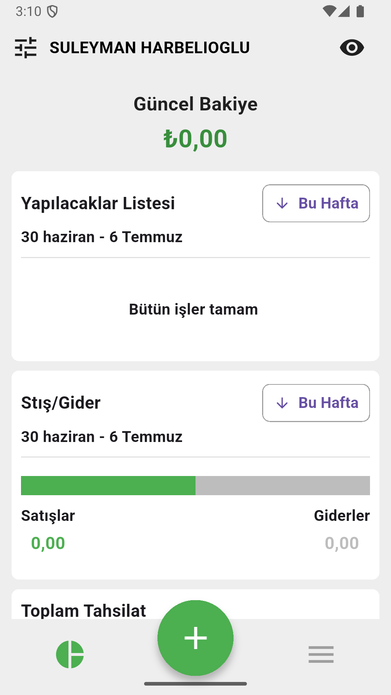
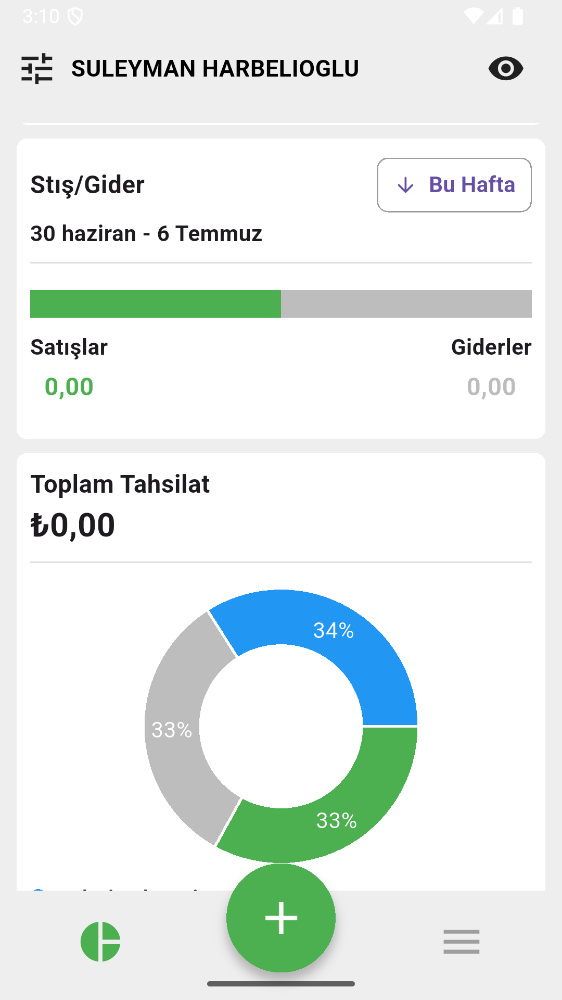
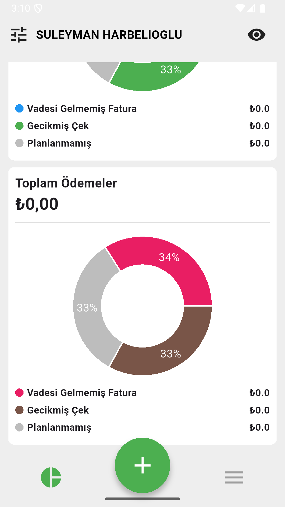
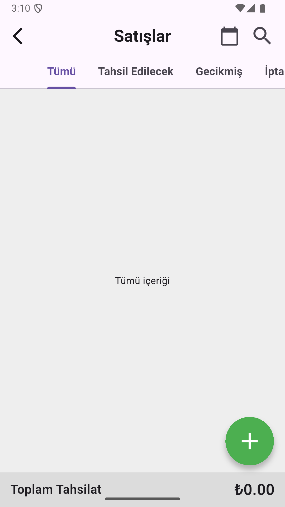
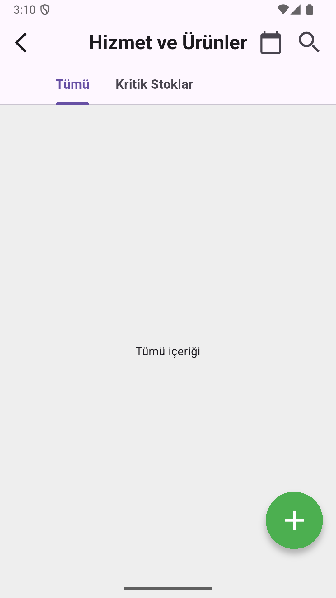
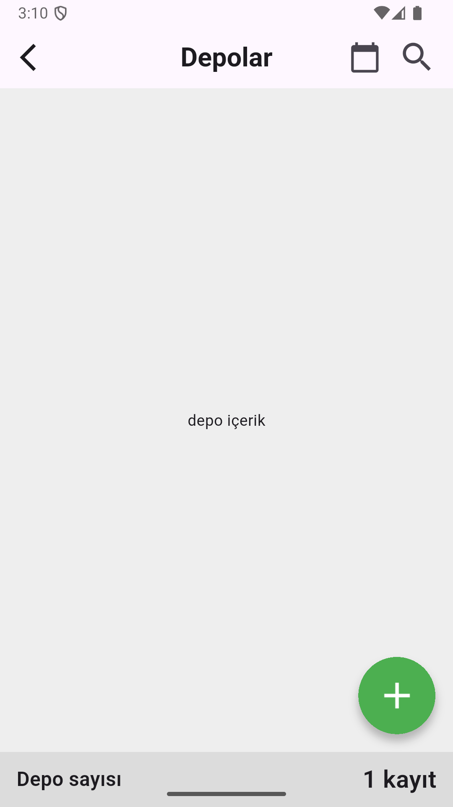
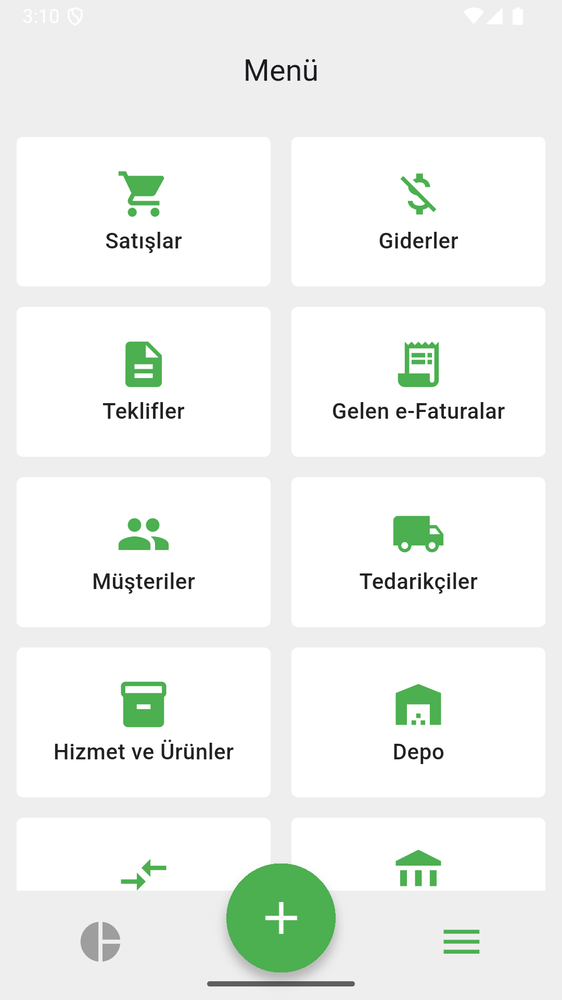

# 📊 Flutter Accounting App UI

A modern **accounting & finance mobile app UI** built with **Flutter**, focusing on clean design, data visualization, and scalable architecture.

This project is a **UI and architecture demo** that showcases how a real-world accounting application could be structured and designed.

> ⚠️ This is a demo project. All financial data shown in the app is mock data.

---

## 📸 Screenshots

### 📈 Dashboard & Financial Overview

  
  
  

**Highlights:**
- Current balance overview
- Income & expense summaries
- Financial status cards
- Clean and readable dashboard layout

---

### 💸 Expenses & Sales

  
  

**Features:**
- Expense listing UI
- Sales tracking screens
- Financial data grouped by type
- Accounting-friendly layout patterns

---

### 🏷 Products, Services & Inventory

  
  

**Features:**
- Products & services management UI
- Inventory / warehouse overview
- Quantity and stock-focused layouts
- Business-oriented design approach

---

### ☰ Menu & Navigation

  

**Features:**
- Centralized menu screen
- Quick access to accounting modules
- Simple and professional navigation structure

---

## 🧰 Tech Stack

- Flutter & Dart  
- State Management (Cubit / Bloc)  
- Dependency Injection  
- Functional Programming Concepts  
- Responsive UI Design  

---

## 📦 Flutter Packages Used

### 🧠 State Management & Architecture
- **flutter_bloc** – Predictable and scalable state management  
- **get_it** – Dependency injection for clean architecture  
- **dartz** – Functional programming utilities (Either, Option)  

### 📊 Data Visualization
- **fl_chart** – Charts and graphs for financial data visualization  

### 🎨 UI & Assets
- **flutter_svg** – High-quality vector icons  
- **cupertino_icons** – Platform-consistent icons  

---

## 🧩 Architecture Overview

The project follows a **feature-based and scalable architecture**:

- **Presentation Layer** – UI components and Bloc/Cubit state management  
- **Domain Layer** – Business logic and use-case definitions  
- **Data Layer** – Mock data sources simulating accounting data  
- **Dependency Injection** – Managed using GetIt  

This structure reflects patterns commonly used in real-world financial applications.

---

## 🎯 Project Purpose

This application is built to demonstrate:

- Professional accounting & finance UI design
- Dashboard and data visualization patterns
- Clean Flutter architecture using Bloc
- How an accounting app can be structured at scale

It is intended for **learning, practice, and portfolio showcase** purposes.

---

## 📌 Disclaimer

- This is **not a production application**
- No real financial or accounting data is used
- No backend or payment system is implemented
- All data displayed is mock data

---

## 👨‍💻 Developer

Developed by **Süleyman Harbelioglu**  
Flutter Developer

🔗 GitHub Profile:  
https://github.com/suleymanharbelioglu
